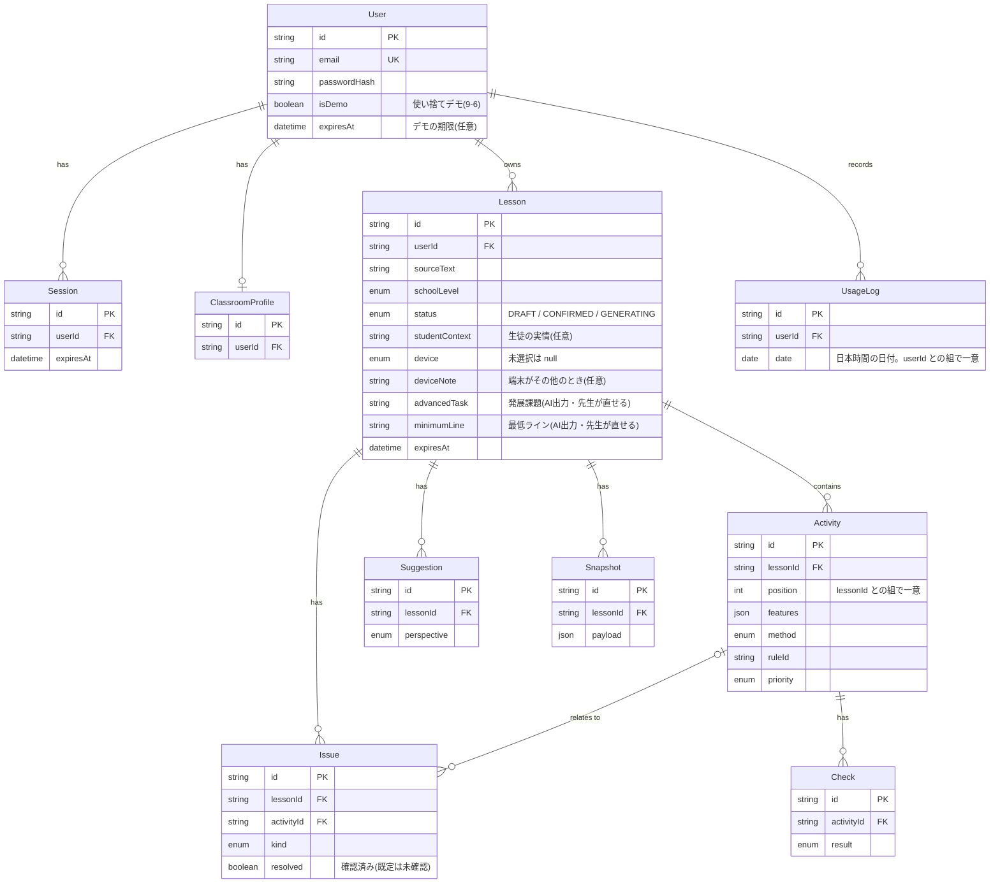

# ER図

```mermaid
erDiagram
  User ||--o{ Session : has
  User ||--o| ClassroomProfile : has
  User ||--o{ Lesson : owns
  User ||--o{ UsageLog : records
  Lesson ||--o{ Activity : contains
  Lesson ||--o{ Issue : has
  Lesson ||--o{ Suggestion : has
  Lesson ||--o{ Snapshot : has
  Activity |o--o{ Issue : "relates to"
  Activity ||--o{ Check : has

  User {
    string id PK
    string email UK
    string passwordHash
    boolean isDemo "使い捨てデモ(9-6)"
    datetime expiresAt "デモの期限(任意)"
  }
  Session {
    string id PK
    string userId FK
    datetime expiresAt
  }
  ClassroomProfile {
    string id PK
    string userId FK
  }
  Lesson {
    string id PK
    string userId FK
    string sourceText
    enum schoolLevel
    enum status "DRAFT / CONFIRMED / GENERATING"
    string studentContext "生徒の実情(任意)"
    enum device "未選択は null"
    string deviceNote "端末がその他のとき(任意)"
    string advancedTask "発展課題(AI出力・先生が直せる)"
    string minimumLine "最低ライン(AI出力・先生が直せる)"
    datetime expiresAt
  }
  Activity {
    string id PK
    string lessonId FK
    int position "lessonId との組で一意"
    json features
    enum method
    string ruleId
    enum priority
  }
  Issue {
    string id PK
    string lessonId FK
    string activityId FK
    enum kind
    boolean resolved "確認済み(既定は未確認)"
  }
  Suggestion {
    string id PK
    string lessonId FK
    enum perspective
  }
  Check {
    string id PK
    string activityId FK
    enum result
  }
  Snapshot {
    string id PK
    string lessonId FK
    json payload
  }
  UsageLog {
    string id PK
    string userId FK
    date date "日本時間の日付。userId との組で一意"
  }
```
